## 📌 功能介紹
### 🔹 前台
- 瀏覽商品清單與詳細資訊
- 加入商品至購物車
- 下單購買
### 🔹 後台
- 商品上架 / 編輯 / 刪除
- 管理商品
- 訂單資訊管理

---

## 🔧 使用技術

| 🔧 前端                                        | 🖥️ 後端                                    | 💾 資料庫                              | 🛠️ 其他工具                                  |
|------------------------------------------------|--------------------------------------------|----------------------------------------|----------------------------------------------|
| |  |  |  |
|  |  |  |   |
||||  |
|  || |                                                |
|  |||
||||
|||||
||||||

### 其他說明

#### 前端技術說明

- **HTML5 & CSS3**：使用標準 HTML5 撰寫網頁結構，並利用 CSS3（包含自訂 CSS）來定義樣式與排版（例如利用 CSS Grid、媒體查詢等建立響應式介面）。
- **Bootstrap**：載入 Bootstrap 提供的 CSS 與 JavaScript 插件，快速實作響應式的導航列、卡片、表單與其他常見 UI 元件，並與自訂樣式搭配使用。
- **jQuery**：載入 jQuery 庫以輔助部分 DOM 操作和事件處理（例如根據側邊欄狀態調整內容區域）。
- **ajax**：使用 Axios 進行 AJAX 請求，與後端 API 交換 JSON 格式資料，實現新增商品、更新資料等功能。
- **SweetAlert2**：整合 SweetAlert2 當作彈出視窗，提供使用者友善的提示與錯誤訊息，改善操作體驗。
- **Font Awesome**：利用 Font Awesome 的圖示，豐富頁面元件（例如選單、按鈕）的視覺呈現，使介面更直觀。

#### 後端技術說明

- **MVC架構**：採用 Model-View-Controller，將資料處理、業務邏輯與畫面輸出分離。
- **RESTful API 設計**：路由遵循 RESTful 原則。
- **CSRF 保護**：啟用 CSRF Token 驗證表單。

#### 資料庫技術說明

- **Ubuntu**：使用 Ubuntu 作為主系統提供穩定且安全的作業環境，適合用來架設資料庫與網頁伺服器。
- **Apache2**：部署 Apache2 作為 Web 伺服器，用於處理 HTTP 請求與傳輸靜態/動態內容。
- **FileZilla**：利用 FileZilla 進行檔案傳輸，使得上傳與管理伺服器上的檔案更為便捷。
- **虛擬機(Virtual Machine)**：將整個部署架設於虛擬機內，提升資源彈性管理以及方便日後維護和擴充。
- **AWS（Amazon Web Services）**：採用 AWS 提供的雲端基礎架構，透過 EC2 虛擬機搭配彈性 IP 與安全群組，實現穩定、安全且可擴展的部署環境。

---

## ⚙️ 功能簡介

### 1. 會員系統
- **會員註冊/登入**：用戶可創建帳號並登入系統。

### 2. 商品系統
- **商品管理**：後台可新增、編輯與刪除商品。

### 3. 賣場系統
- **訂單管理**：後台可查看與處理訂單，更新訂單狀態。
- **購物車功能**：用戶可以將商品加入購物車，並在購物車選擇數量。
- **訂單歷史記錄**：用戶可查看歷史訂單，並追蹤訂單狀態。

### 4. 前台功能
- **商品展示**：以視覺化方式展示商品，包含圖片、價格等信息。
- **響應式設計**：平台支持手機與桌面設備，提供最佳的瀏覽體驗。

### 📦 後台畫面展示

#### 🔐 後台登入

#### 🏠 後台主頁

#### ➕ 後台商品
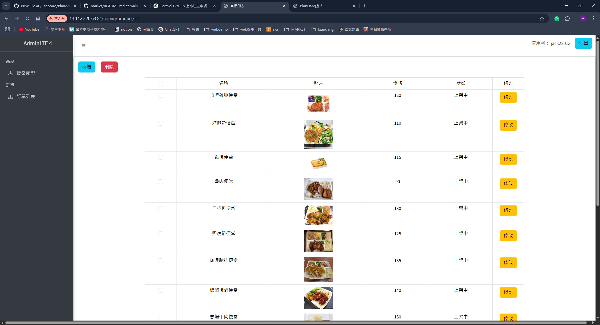

#### ➕ 後台新增商品
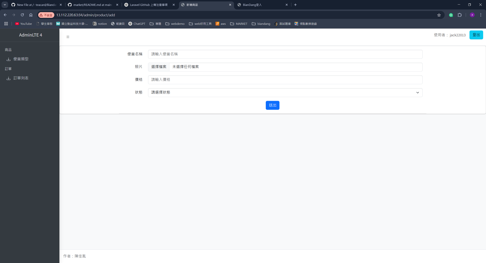
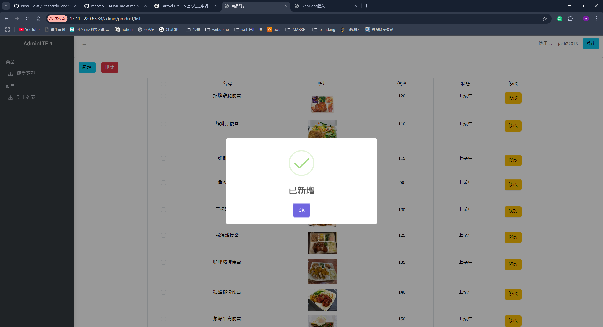

#### ✏️ 後台修改商品
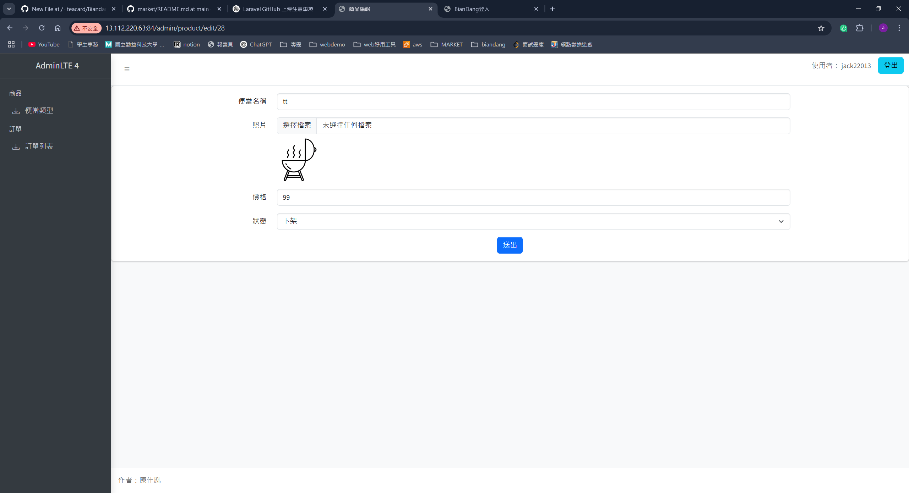

#### ❌ 後台刪除商品
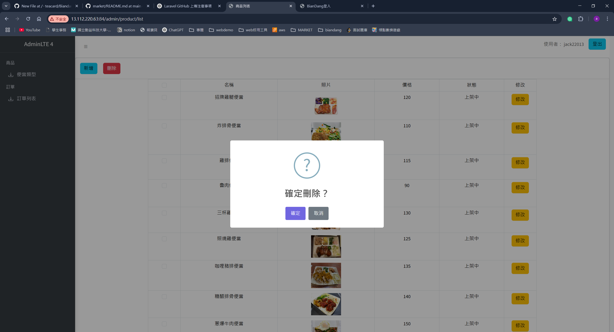

#### 🛠️ 後台訂單管理
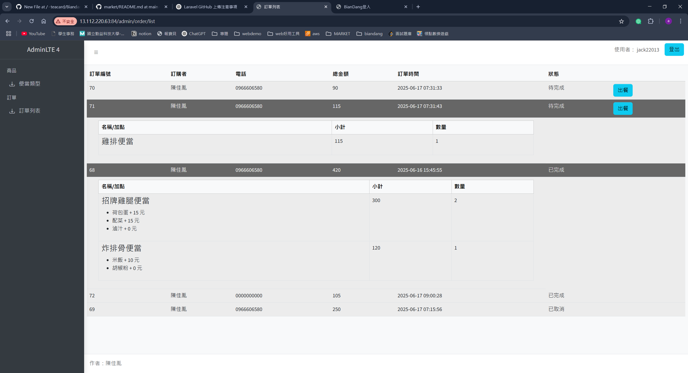
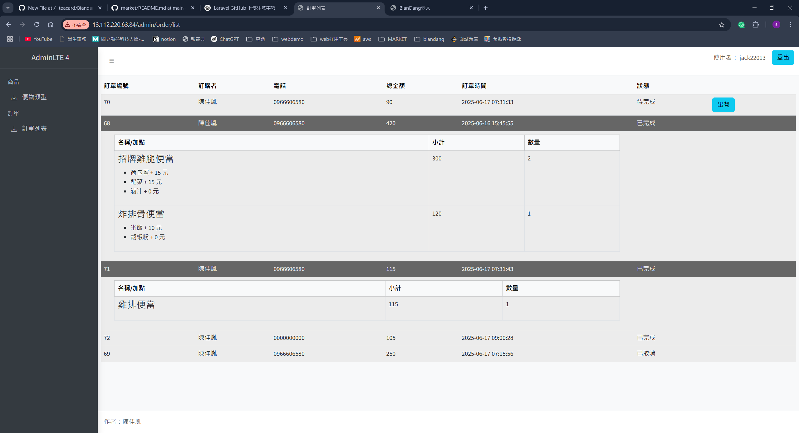

---

### 🛒 前台畫面展示

#### 🔐 前台登入 / 註冊
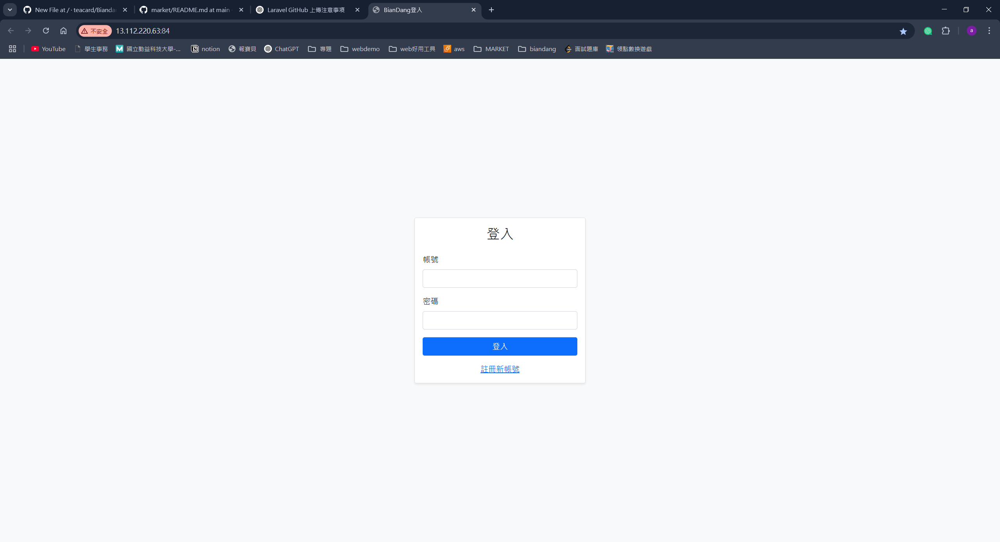
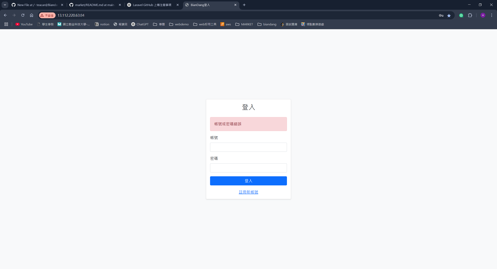

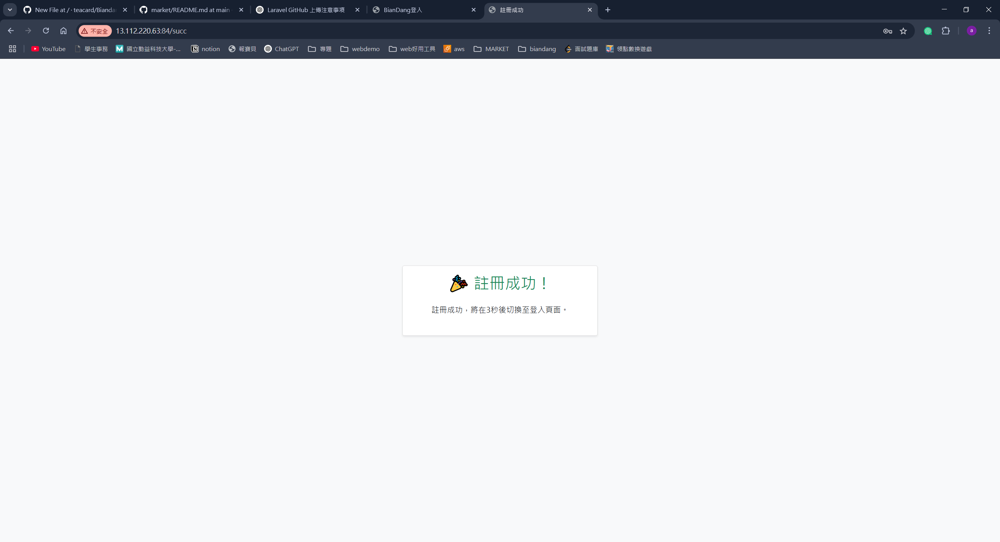
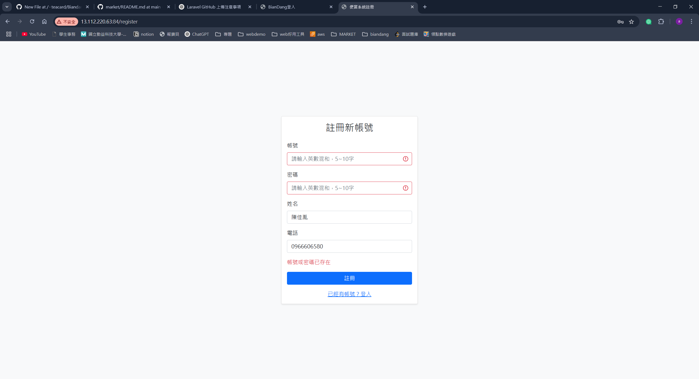

#### 📦 前台主頁 / 商品瀏覽
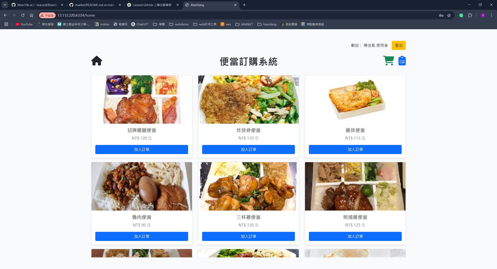
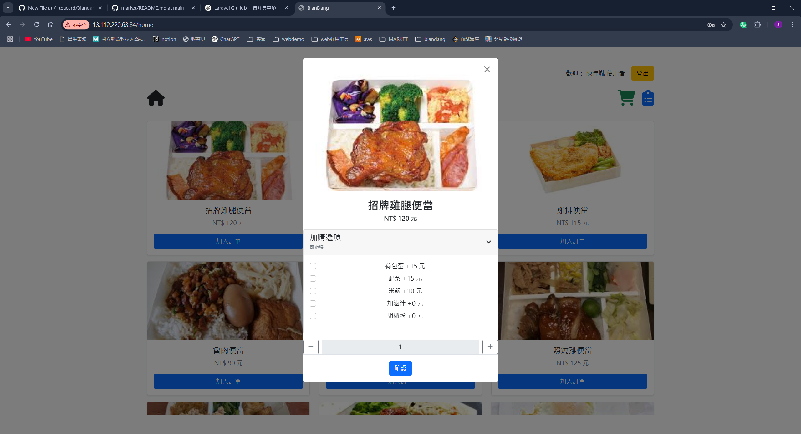
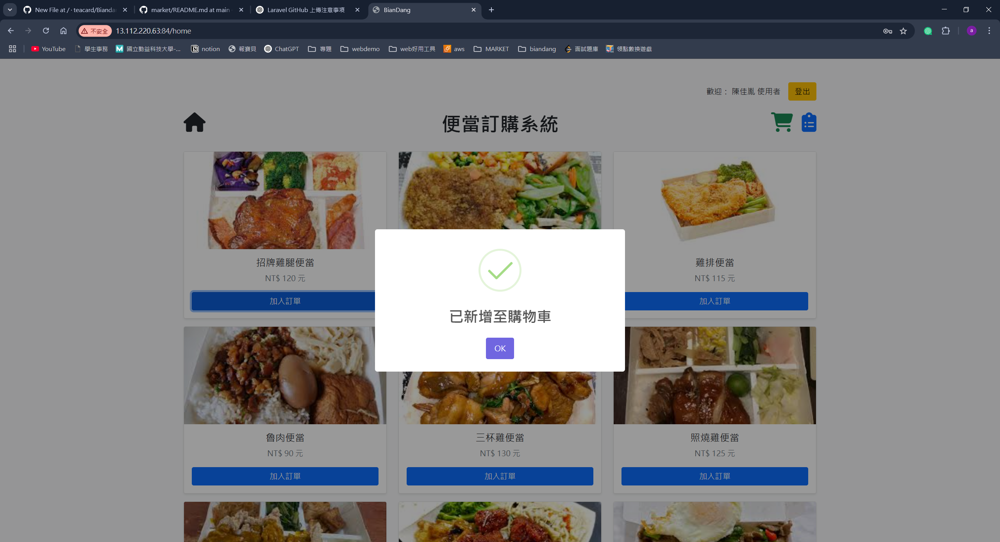

#### 🛍️ 前台購物車與訂單
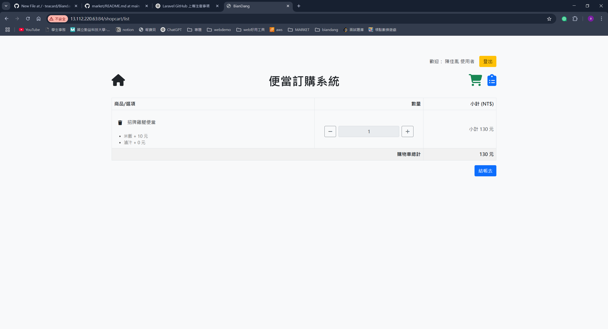
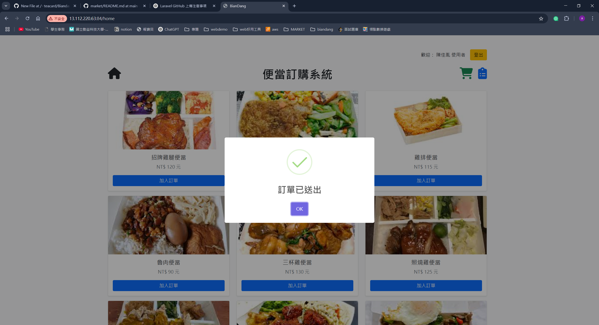

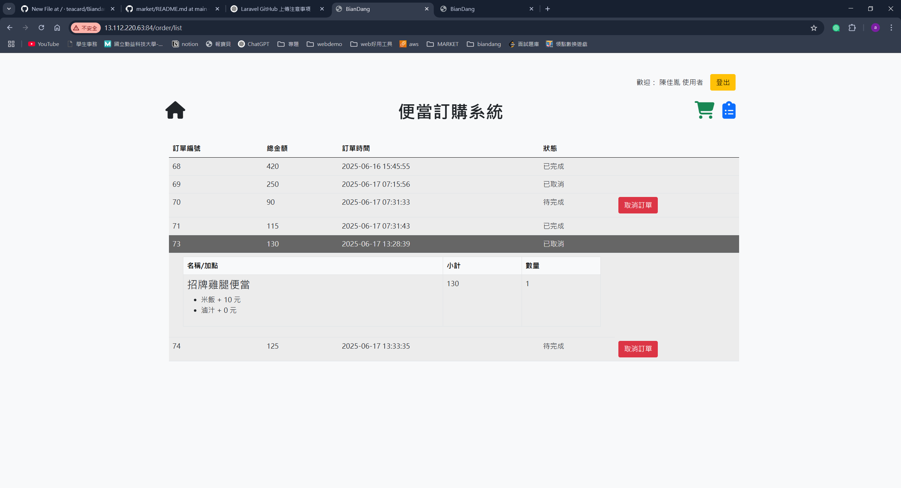

## 📬 聯絡作者
- **👤作者**：teacard
- **📧Email**: chap39672@gmail.com
