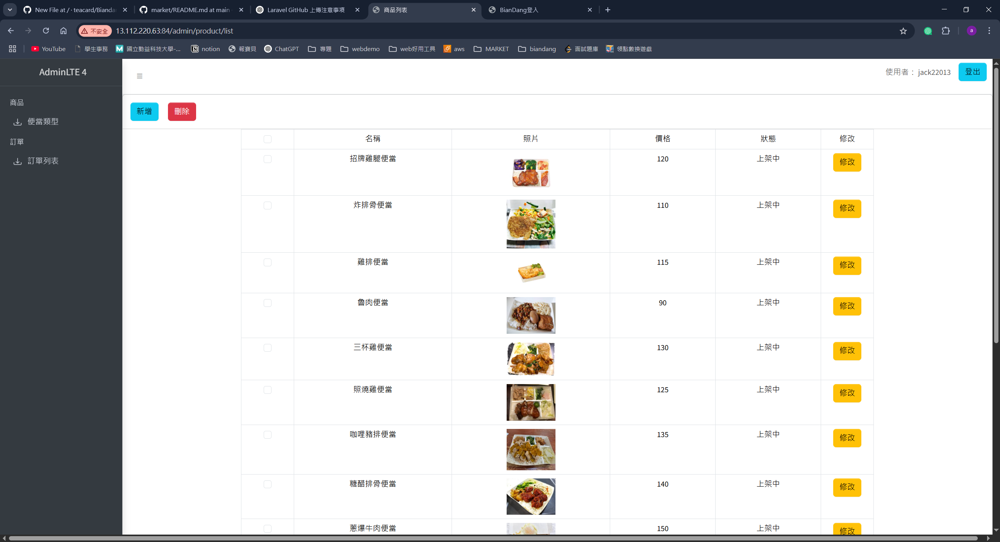
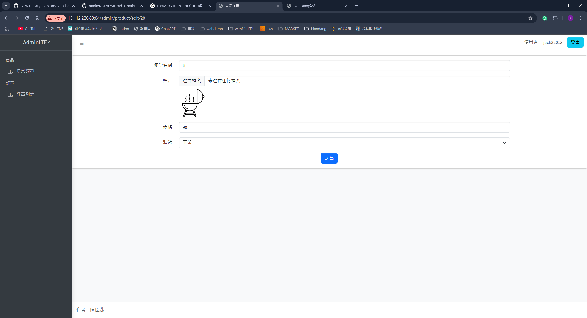
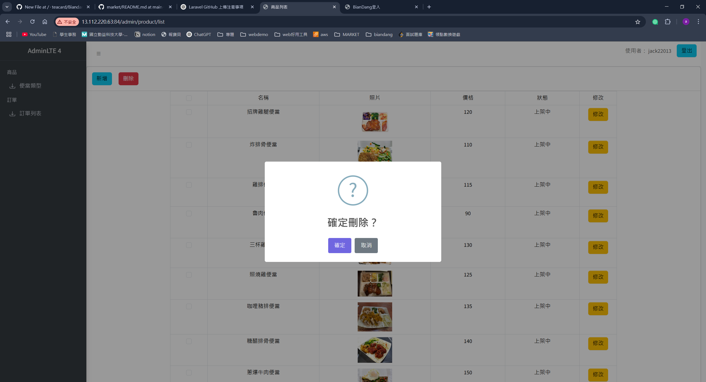
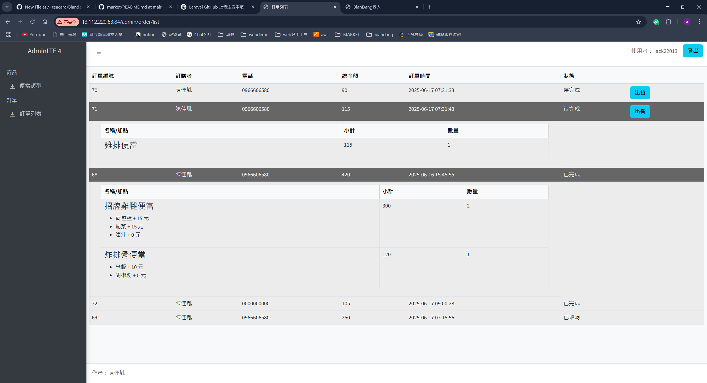
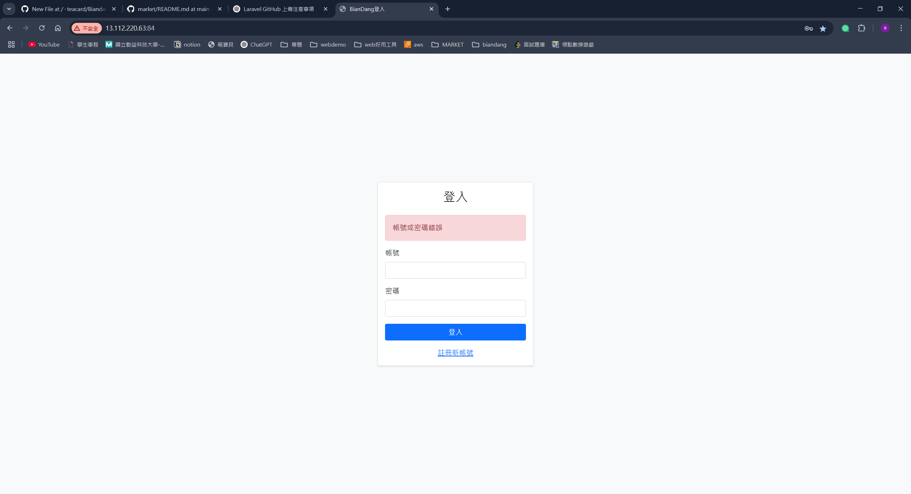
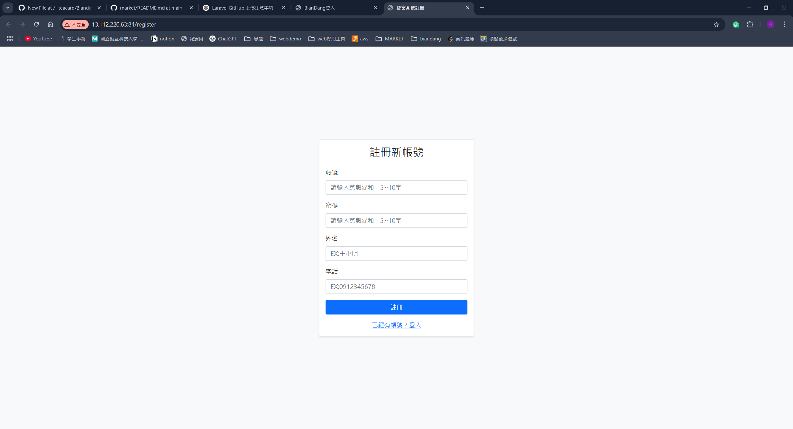
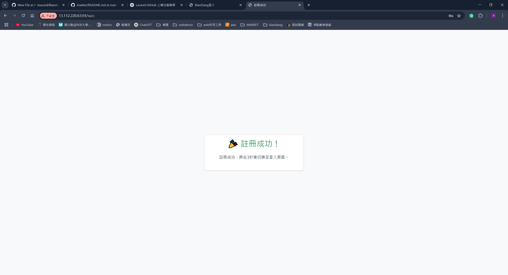
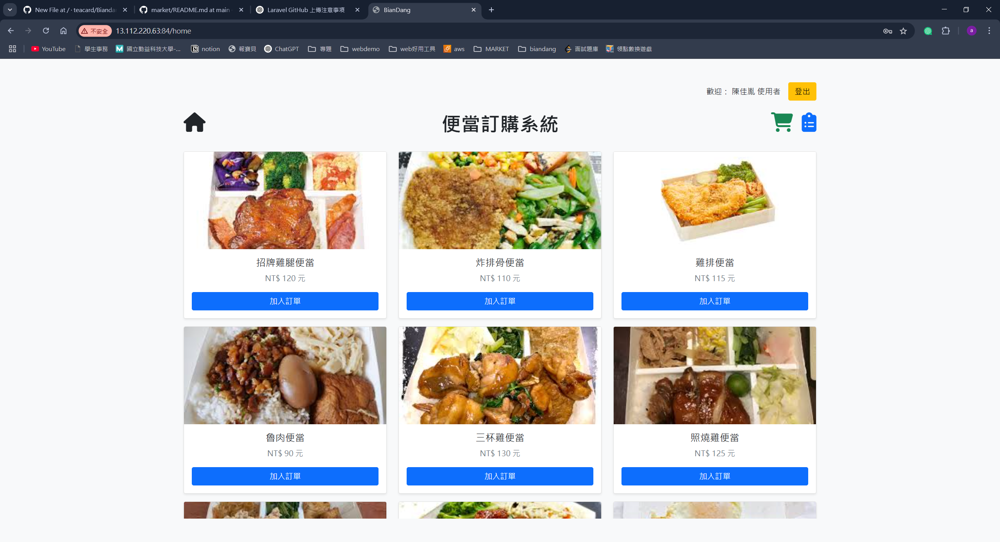
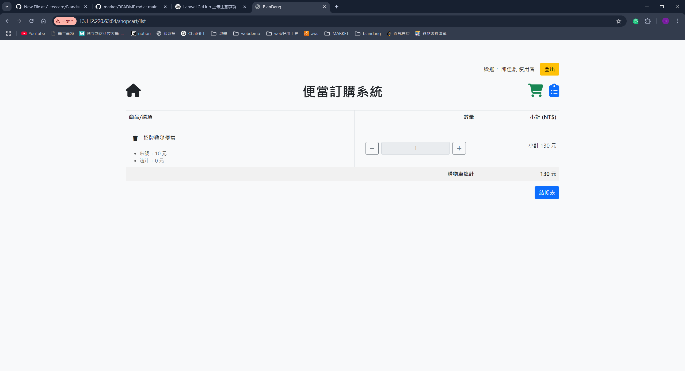
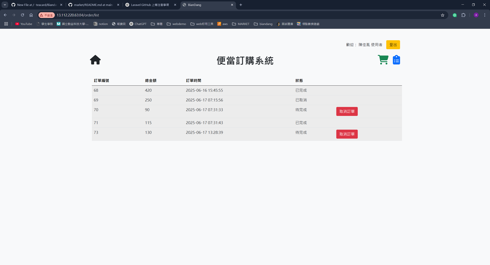

## 📌 功能介紹
### 🔹 å‰å°
- ç€è¦½å•†å“清單與詳細資訊
- 商å“分é¡èˆ‡ç³»åˆ—篩é¸
- 加入商å“至購物車
- 下單購買æµç¨‹
### 🔹 後å°
- 商å“ä¸Šæ¶ / 編輯 / 刪除
- 管ç†å•†å“分é¡èˆ‡ç³»åˆ—
- 訂單與會員資訊管ç†

---

## 🔧 使用技術

| 🔧 å‰ç«¯                                        | ğŸ–¥ï¸ å¾Œç«¯                                    | 💾 資料庫                              | ğŸ› ï¸ å…¶ä»–å·¥å…·                                  |
|------------------------------------------------|--------------------------------------------|----------------------------------------|----------------------------------------------|
| |  |  |  |
|  |  |  |   |
|  |||  |
|  || |                                                |
|  |||
|  |||
|  ||
||
|  ||                                          |                                                |
|  ||                                          |                                                |
|  |  |  |
|  |  |  |
|  |  |  |

### 其他說æ˜

#### å‰ç«¯æŠ€è¡“說æ˜

- **HTML5 & CSS3**：使用標準 HTML5 撰寫網é çµæ§‹ï¼Œä¸¦åˆ©ç”¨ CSS3（包å«è‡ªè¨‚ CSS）來定義樣å¼èˆ‡æ’版（例如利用 CSS Gridã€åª’體查詢等建立響應å¼ä»‹é¢ï¼‰ã€‚
- **Bootstrap**：載入 Bootstrap æ供的 CSS 與 JavaScript æ’件，快速實作響應å¼çš„å°èˆªåˆ—ã€å¡ç‰‡ã€è¡¨å–®èˆ‡å…¶ä»–常見 UI 元件，並與自訂樣å¼æ­é…使用。
- **jQuery**：載入 jQuery 庫以輔助部分 DOM æ“作和事件處ç†ï¼ˆä¾‹å¦‚根據å´é‚Šæ¬„狀態調整內容å€åŸŸï¼‰ã€‚
- **ajax**：使用 Axios 進行 AJAX 請求，與後端 API äº¤æ› JSON æ ¼å¼è³‡æ–™ï¼Œå¯¦ç¾æ–°å¢å•†å“ã€æ›´æ–°è³‡æ–™ç­‰åŠŸèƒ½ã€‚
- **SweetAlert2**ï¼šæ•´åˆ SweetAlert2 當作彈出視窗，æ供使用者å‹å–„çš„æ示與錯誤訊æ¯ï¼Œæ”¹å–„æ“作體驗。
- **Font Awesome**：利用 Font Awesome 的圖示，è±å¯Œé é¢å…ƒä»¶ï¼ˆä¾‹å¦‚é¸å–®ã€æŒ‰éˆ•ï¼‰çš„視覺呈ç¾ï¼Œä½¿ä»‹é¢æ›´ç›´è§€ã€‚

#### 後端技術說æ˜

- **MVCæ¶æ§‹**：æ¡ç”¨ Model-View-Controller，將資料處ç†ã€æ¥­å‹™é‚輯與畫é¢è¼¸å‡ºåˆ†é›¢ã€‚
- **RESTful API 設計**：路由éµå¾ª RESTful åŸå‰‡ã€‚
- **CSRF ä¿è­·**：啟用 CSRF Token 驗證表單。

#### 資料庫技術說æ˜

- **Ubuntu**：使用 Ubuntu 作為主系統æ供穩定且安全的作業環境，é©åˆç”¨ä¾†æ¶è¨­è³‡æ–™åº«èˆ‡ç¶²é ä¼ºæœå™¨ã€‚
- **Apache2**：部署 Apache2 作為 Web 伺æœå™¨ï¼Œç”¨æ–¼è™•ç† HTTP 請求與傳輸éœæ…‹/動態內容。
- **FileZilla**：利用 FileZilla 進行檔案傳輸，使得上傳與管ç†ä¼ºæœå™¨ä¸Šçš„檔案更為便æ·ã€‚
- **虛擬機(Virtual Machine)**：將整個部署æ¶è¨­æ–¼è™›æ“¬æ©Ÿå…§ï¼Œæå‡è³‡æºå½ˆæ€§ç®¡ç†ä»¥åŠæ–¹ä¾¿æ—¥å¾Œç¶­è­·å’Œæ“´å……。
- **AWS（Amazon Web Services）**：æ¡ç”¨ AWS æ供的雲端基ç¤æ¶æ§‹ï¼Œé€é EC2 虛擬機æ­é…彈性 IP 與安全群組，實ç¾ç©©å®šã€å®‰å…¨ä¸”å¯æ“´å±•çš„部署環境。

---

## âš™ï¸ åŠŸèƒ½ç°¡ä»‹

### 1. 會員系統
- **會員註冊/登入**：用戶å¯å‰µå»ºå¸³è™Ÿä¸¦ç™»å…¥ç³»çµ±ã€‚

### 2. 商å“系統
- **商å“管ç†**：後端å¯æ–°å¢ã€ç·¨è¼¯èˆ‡åˆªé™¤å•†å“。

### 3. 賣場系統
- **訂單管ç†**：後端å¯æŸ¥çœ‹èˆ‡è™•ç†è¨‚單，更新訂單狀態。
- **購物車功能**：用戶å¯ä»¥å°‡å•†å“加入購物車，並在çµå¸³æ™‚é¸æ“‡æ•¸é‡å’Œè¦æ ¼ã€‚
- **訂單歷å²è¨˜éŒ„**：用戶å¯æŸ¥çœ‹æ­·å²è¨‚單，並追蹤訂單狀態。

### 4. å‰å°åŠŸèƒ½
- **商å“展示**：以視覺化方å¼å±•ç¤ºå•†å“，包å«åœ–片ã€åƒ¹æ ¼ã€é¡è‰²ã€å°ºå¯¸ç­‰è©³ç´°ä¿¡æ¯ã€‚
- **響應å¼è¨­è¨ˆ**：平å°æ”¯æŒæ‰‹æ©Ÿèˆ‡æ¡Œé¢è¨­å‚™ï¼Œæ供最佳的ç€è¦½é«”驗。

### 📦 後å°ç•«é¢å±•ç¤º

#### 🔠後å°ç™»å…¥

#### 🠠後å°ä¸»é 

#### ╠後å°å•†å“

#### ╠後å°æ–°å¢å•†å“

#### âœï¸ 後å°ä¿®æ”¹å•†å“

#### ⌠後å°åˆªé™¤å•†å“

#### ğŸ› ï¸ å¾Œå°è¨‚單管ç†

---

### 🛒 å‰å°ç•«é¢å±•ç¤º

#### 🔠å‰å°ç™»å…¥ / 註冊

#### 📦 å‰å°ä¸»é  / 商å“ç€è¦½

#### ğŸ›ï¸ å‰å°è³¼ç‰©è»Šèˆ‡è¨‚å–®

## 📬 è¯çµ¡ä½œè€…
- **👤作者**：teacard
- **📧Email**: chap39672@gmail.com
